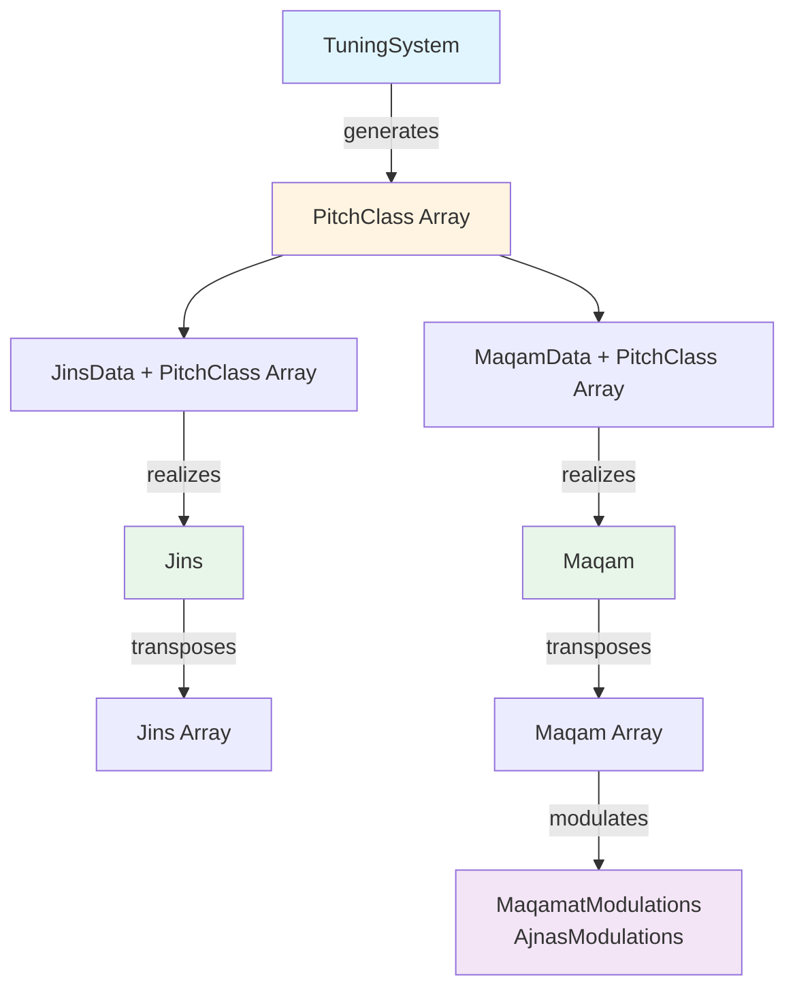

# Architecture Essentials

**PURPOSE**: Core technical architecture patterns and component organization for DiArMaqAr.

**LOAD**: For development tasks involving architecture, new features, or system understanding.

---

## Technology Stack

### Frontend
- **Framework**: Next.js 15 with App Router
- **UI Library**: React 19
- **Language**: TypeScript
- **Styling**: SCSS modules
- **Audio**: Web Audio API (custom implementation)
- **Notation**: VexFlow
- **Documentation**: TypeDoc

### Backend/Processing
- **Runtime**: Node.js (for CLI tools and SSR)
- **Data Format**: JSON

---

## Context Provider Hierarchy

**CRITICAL**: The root layout establishes context nesting that MUST be maintained:

```typescript
// src/app/layout.tsx
LanguageContextProvider
  └─ AppContextProvider              // Core state
      └─ SoundContextProvider        // Audio
          └─ TranspositionsContextProvider
              └─ MenuContextProvider
                  └─ FilterContextProvider
```

**Why this order matters:**
- `LanguageContext` - Needed by all other contexts for bilingual support
- `AppContext` - Loads all data, manages selections, provides core state
- `SoundContext` - Depends on AppContext for pitch classes
- `TranspositionsContext` - Pre-computes expensive transpositions
- `MenuContext` - UI state
- `FilterContext` - Search/filter state

---

## Core Contexts

### AppContext (Central State Manager)

**Location**: [src/contexts/app-context.tsx](../../src/contexts/app-context.tsx)

**Responsibilities:**
- Load all data on mount: tuning systems, ajnas, maqamat, sources, patterns
- Manage selected tuning system, jins, maqam state
- Provide selection handlers: `handleClickJins()`, `handleClickMaqam()`
- Generate pitch classes from selected tuning system
- Handle URL parameter routing
- Manage pitch class selection and reference frequencies
- Provide modulation analysis

**Key State:**
```typescript
{
  tuningSystems: TuningSystem[];
  ajnas: JinsData[];
  maqamat: MaqamData[];
  sources: Source[];
  patterns: Pattern[];
  selectedTuningSystem: TuningSystem | null;
  selectedJins: JinsData | null;
  selectedMaqam: MaqamData | null;
  allPitchClasses: PitchClass[];
  selectedPitchClasses: PitchClass[];
  // ... more state
}
```

### SoundContext (Audio Management)

**Location**: [src/contexts/sound-context.tsx](../../src/contexts/sound-context.tsx)

**Responsibilities:**
- Abstract Web Audio API
- Manage audio context and synth configuration
- Support different timbres
- Play individual pitch classes or sequences

**Client-side guards required:**
```typescript
useEffect(() => {
  if (typeof window !== 'undefined') {
    // Web Audio API code here
  }
}, []);
```

### TranspositionsContext (Performance Optimization)

**Location**: [src/contexts/transpositions-context.tsx](../../src/contexts/transpositions-context.tsx)

**Responsibilities:**
- Pre-compute expensive transposition calculations
- Cache results to avoid repeated calculations
- Provide transpositions to multiple components

**Why needed**: Modulation calculations can take minutes for complex systems.

---

## Data Model Relationships

### Model Hierarchy



### Key Transformations

**1. Tuning System → Pitch Classes**
```typescript
// Function: getTuningSystemPitchClasses()
const pitchClasses = getTuningSystemPitchClasses(
  tuningSystem,
  startingNote,
  referenceFrequency
);
```

**2. JinsData + Pitch Classes → Jins (Tahlil)**
```typescript
// Method: JinsData.getTahlil()
const jins = jinsData.getTahlil(pitchClasses, tolerance);
```

**3. JinsData + Pitch Classes → Jins[] (Taswir)**
```typescript
// Function: calculateJinsTranspositions()
const jinsTranspositions = calculateJinsTranspositions(
  pitchClasses,
  jinsData,
  tolerance
);
```

**4. MaqamData + Pitch Classes → Maqam (Tahlil)**
```typescript
// Method: MaqamData.getTahlil()
const maqam = maqamData.getTahlil(pitchClasses, tolerance);
```

**5. MaqamData + Pitch Classes → Maqam[] (Taswir)**
```typescript
// Function: calculateMaqamTranspositions()
const maqamTranspositions = calculateMaqamTranspositions(
  pitchClasses,
  maqamData,
  tolerance,
  includeEmbeddedAjnas
);
```

**6. Maqam → Modulations**
```typescript
// Function: modulate()
const modulations = modulate(
  maqam,
  pitchClasses,
  allJinsData,
  allMaqamData,
  mode, // 'maqamat' or 'ajnas'
  tolerance
);
```

**7. Maqam → Family Classification**
```typescript
// Function: classifyMaqamFamily()
const classification = classifyMaqamFamily(maqam);
// Returns: { method, familyName, fullJinsName, scaleDegree, source }
```

**CRITICAL**: Family classification requires a `Maqam` object (not `MaqamData`), which means it needs ajnās analysis. For consistent classification across all maqāmāt, always use **al-Ṣabbāgh (1954)** as the canonical tuning system reference with each maqām's own canonical starting note. See [03-development-quick-ref.md](03-development-quick-ref.md) → "Family Classification Pattern" for implementation details.

---

## Note Name System

### NoteName Type

**Location**: [src/models/NoteName.ts](../../src/models/NoteName.ts)

**Purpose**: Defines all valid transliterated Arabic note names.

**Critical Understanding**: Note names are **cultural identifiers**, NOT pitch classes. The same note name can have different frequencies in different tuning systems.

### Octave System

| Octave | Arabic Term | Prefix | Example |
|--------|-------------|--------|---------|
| 1 | qarār | None | dūgāh |
| 2 | ʿushayrān | None | dūgāh |
| 3 | jawāb | _j | dūgāh_j |
| 4 | jawāb jawāb | _jj | dūgāh_jj |

**Functions:**
- `shiftNoteName(name, octaves)` - Shift note names up/down octaves
- `getNoteNameOctave(name)` - Get octave number from note name

---

## Path Aliases

**Always use** `@/*` for imports (configured in `tsconfig.json`):

```typescript
// ✅ Correct
import { getTuningSystems } from '@/functions/import';
import NoteName from '@/models/NoteName';
import { useAppContext } from '@/contexts/app-context';

// ❌ Wrong
import { getTuningSystems } from '../../../functions/import';
```

---

## API Design Patterns

### Progressive Disclosure Pattern

**Pattern**: Users discover → check availability → commit to data retrieval

```
1. LIST      → Browse all maqāmāt/ajnās (metadata only)
2. AVAILABLE → Check compatibility with tuning systems
3. DATA      → Get full data with flexible formatting
```

**Benefits:**
- Reduced bandwidth for exploratory queries
- Clear separation of concerns
- Supports both casual exploration and deep analysis

**Example:**
```typescript
// Step 1: List all maqāmāt (metadata only)
GET /api/maqamat
→ Returns: id, name, family, availability count

// Step 2: Check availability
GET /api/maqamat/{id}/availability
→ Returns: which (tuningSystem, startingNote) support this maqām

// Step 3: Get full data
GET /api/maqamat/{id}?tuningSystem=X&startingNote=Y&format=all
→ Returns: complete pitch classes, intervals, ajnās, modulations
```

### Format Negotiation Pattern

**Pattern**: Single endpoint, multiple representations

**Available Formats:**
- `format=cents` - Western notation (default visualization)
- `format=frequency` - Synthesis/audio applications
- `format=fraction` - Theoretical analysis (ratios)
- `format=midi` - MIDI controllers
- `format=stringLength` - Lute/oud instruments
- `format=all` - All representations

**Implementation:**
```typescript
GET /api/maqamat/{id}?tuningSystem=X&startingNote=Y&format=cents
→ Returns only cents values

GET /api/maqamat/{id}?tuningSystem=X&startingNote=Y&format=all
→ Returns all format representations
```

### Diacritics Insensitivity Pattern

**Pattern**: All text matching uses `standardizeText()` utility

**Purpose**: Reduce API friction for non-Arabic keyboards

**Examples:**
- "yegah" matches "yegāh"
- "rast" matches "rāst"
- "Sabbagh" matches "Ṣabbāgh"

**Implementation:**
```typescript
import { standardizeText } from '@/functions/utilities';

// Matching
if (standardizeText(family) === standardizeText(maqam.family)) { ... }

// Sorting
families.sort((a, b) =>
  standardizeText(a).localeCompare(standardizeText(b))
);
```

---

## Component Patterns

### Manager Components

**Pattern**: Follow `tuning-system-manager.tsx` structure

**Characteristics:**
- Handle CRUD operations
- Support admin/user modes
- Use FilterContext for search
- Implement bilingual support
- Connect to proper data sources

### Transposition Components

**Pattern**: Follow `jins-transpositions.tsx` structure

**Characteristics:**
- Display all valid transpositions
- Pre-compute using TranspositionsContext
- Support filtering and search
- Show availability counts
- Enable selection/playback

### Visualization Components

**Pattern**: Follow `staff-notation.tsx` structure

**Characteristics:**
- Render musical notation or analysis
- Use VexFlow for staff notation
- Support both ascending/descending sequences
- Handle enharmonic spelling
- Provide interactive features

---

## Performance Considerations

### Expensive Operations

**Transposition Calculations:**
- Pattern matching across 4 octaves
- Can take seconds for complex systems
- Pre-compute in TranspositionsContext

**Modulation Analysis:**
- Nested transposition calls
- Can take minutes per tuning system
- Show progress indicators
- Use `setTimeout(resolve, 0)` for UI responsiveness

**Large Exports:**
- Full system exports can be GB of data
- Memory optimization: Auto-set 4GB Node limit
- Progress tracking essential
- Filename sanitization for cross-platform compatibility

### Optimization Strategies

```typescript
// Use useMemo for expensive calculations
const expensiveData = useMemo(() =>
  computeComplexCalculation(),
  [dependencies]
);

// Pre-compute in context
const { allTranspositions } = useTranspositionsContext();

// Yield control during long operations
await new Promise(resolve => setTimeout(resolve, 0));
```

---

## Client-Side vs Server-Side

### Client-Side Only

**Web Audio API:**
```typescript
"use client"; // Required directive

useEffect(() => {
  if (typeof window !== 'undefined') {
    // Web Audio code here
  }
}, []);
```

**React State & Hooks:**
- All context providers
- Components using useState, useEffect, etc.
- Event handlers

### Server-Side

**API Routes:**
- Data loading and processing
- Heavy computations
- File system access

**Static Generation:**
- Documentation pages
- Static assets

---

## State Management Flow

### Cascading Updates

```
User changes tuning system
  → AppContext updates selectedTuningSystem
    → AppContext recalculates allPitchClasses
      → TranspositionsContext recalculates transpositions
        → UI components re-render with new data
          → SoundContext updates playable pitch classes
```

### State Cleanup

**When tuning system changes:**
```typescript
// Full cleanup
clearSelections();

// Partial cleanup
clearJinsSelections();
clearMaqamSelections();
```

### URL State Synchronization

```typescript
// Enable deep-linking
handleUrlParams({
  maqam: 'maqam-rast-al-rast',
  tuningSystem: 'Al-Farabi-(950g)',
  startingNote: 'yegah_5'
});
```

---

## Export System Architecture

### Web UI Export Modal

**Location**: Component in main app

**Features:**
- Export selected tuning system configuration
- Optional: ajnas details, maqamat details, modulations
- Same data structure as batch CLI

### CLI Batch Export

**Location**: [scripts/batch-export/batch-export.js](../../scripts/batch-export/batch-export.js)

**Features:**
- Built with `tsx` for TypeScript execution
- Memory optimization (4GB Node limit)
- Filename sanitization (cross-platform)
- Timestamped batch folders
- Progress tracking

**For detailed commands**: See [reference/cli-commands-guide.md](../reference/cli-commands-guide.md)

---

## Integration Checklist

When adding new features:

- [ ] Use `@/*` path imports exclusively
- [ ] Integrate with AppContext for core state
- [ ] Use appropriate context (Sound, Transpositions, Language, etc.)
- [ ] Guard Web Audio with client-side checks
- [ ] Implement bilingual support via LanguageContext
- [ ] Use FilterContext for search/filter features
- [ ] Follow established component patterns
- [ ] Consider performance (memoization, pre-computation)
- [ ] Update TypeDoc comments
- [ ] Test across multiple tuning systems
- [ ] Verify URL parameter integration
- [ ] Document significant patterns discovered

---

## Additional Resources

**For detailed API design patterns and lessons learned**: See [reference/api-retrospective.md](../reference/api-retrospective.md)

**For API route implementation details**: See `src/app/api/playground/SESSION_SUMMARY.md`
